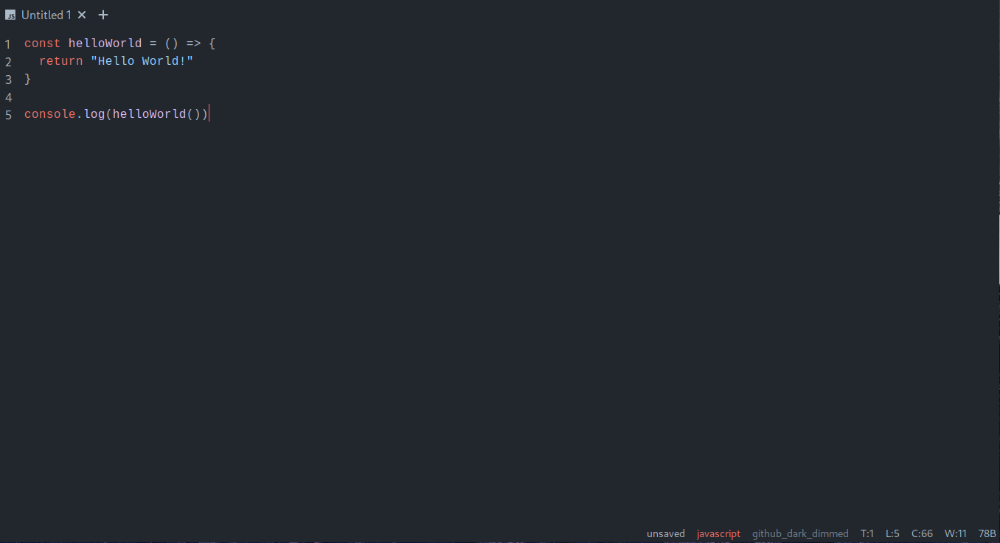

# Tux - A Minimal Code/Text Editor

Tux is very simple code and text editor with minimal features. It is build with rust framework `Tauri`, the frontend is build purely with vanilla Javascript, HTML , and CSS.

## What is Tux?

1. Minimal, lightweight out of the box beautiful text & code editor with countless themes.
2. AutoComplete and Autosuggest keywords for various programming languages.
3. Search using word or regex, replace using word or regex.
4. Keyboard oriented workflow with standard easy-to-remember keyboard shortcuts.
5. Tab based editor.
6. Auto language detection and syntax highlighting.
7. Auto-Save files, Zen mode.

## Installation

Grab the appropiate binary for your operating system from the [releases](https://github.com/Sidmaz666/tux/releases/tag/v0.0.0) and install Tux on your system.

## Tux Keyboard Shortcuts

1. `Ctrl+t` - Add new tab
2. `Ctrl+{Number}` - For example, Ctrl+2 - Go to Tab 2
3. `Ctrl+Tab` - Cycle Through all the tabs
4. `Ctrl+q` - Close current Tab
5. `Ctrl+f` - Find, Replace Text
6. `Ctrl+G` - Move to the Bottom of the document
7. `Ctrl+g` - Move to the Top of the document
8. `Ctrl+z` - Undo
9. `Ctrl+y` - Redo
10. `Ctrl+T` - Open Theme Picker
11. `Ctrl+o` - Open a Single File
12. `Ctrl+O` - Open Multiple Files
13. `Ctrl+s` - Save unsaved file
14. `Ctrl+Q` - Close Tux Editor
15. `Ctrl+=` - Increase Font Size of the current Tab
16. `Ctrl+-` - Decrease Font Size of the current Tab
17. `F11` - Enable Zen Mode, Go Fullscreen

## How to Find and Replace Text on Tux?

### 1. Find

To find a text using a pattern such as the word `world`, press `Ctrl+f` then simply type te word `world` and press Enter. 
You can also pass flags, to search case insensetve word `world`, type the word first, then along with a forward slash type `f=`
and pass the flag `i`. For example, `world/f=i` 

You can also use regex instead of searching the word, `however keep in mind that the regex should be typed without starting and ending forward slahes`
For example: `h.*ld`, You can also pass flags using a forward slash and `f=` command.

### 2. Find and Replace

To find and replace a text, press `Ctrl+f`, now type a forward slash first, it is very important that you start the word that you want to find and replace starts with a forward slash. Then type the word for example `world`, then again type a forward slash and type the command `r=` , type the word that you want to replace with.
For example: `/world/r=earth`, You can also use regex and use flags, For example: `/w.*ld/r=earth/f=gi`

## What is used for Tux development?

For ease of developing Tux is styled with tailwindcss and there are few JS libraries and CSS helpers that have been used during the developing process which are mentioned below:

1. `hilightjs` - For syntax highlighting, language detection and overall code editor themes.
2. `markjs` - To mark specific words during search
3. `devicon` - Display various programming languages icons
4. `caret_position.js` - To get the caret position in the textarea ([Link](https://github.com/component/textarea-caret-position))
5. `fontawesome` - For Font Icons

## TODOS

1. Custom Config File to configure Tux Editor.
2. Create Tux API's for extension development.
3. Integrating LSP and more robust features. 

